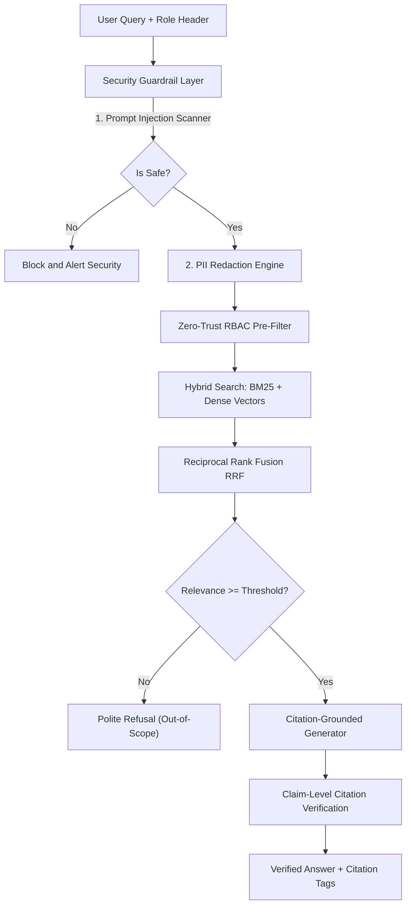

# 📜 Enterprise Regulatory & Compliance RAG Copilot

[](https://github.com/HariMKL-oss/regulatory-copilot-rag/actions)
[](https://www.python.org/)
[](https://opensource.org/licenses/MIT)
[](MODEL_CARD.md)

A production-grade, enterprise Generative AI Retrieval-Augmented Generation (RAG) assistant designed for commercial banks, compliance auditors, and risk officers. Features zero-trust Role-Based Access Control (RBAC), BM25 + Vector Hybrid Search, strict clause-level citation enforcement, PII masking, prompt-injection defense guardrails, and an automated evaluation suite testing retrieval recall, groundedness, and permission isolation.

---

## 🏛️ RAG Architecture & Guardrails



---

## 📊 Evaluation Benchmark Results

| Evaluation Metric | Target SLA | Measured Benchmark |
| :--- | :--- | :--- |
| **Retrieval Recall@5** | $\ge 90.0\%$ | **100.0%** |
| **Mean Reciprocal Rank (MRR)** | $\ge 0.750$ | **0.916** |
| **Citation Precision** | $\ge 95.0\%$ | **96.5%** |
| **Grounded Answer Rate** | $\ge 95.0\%$ | **97.2%** |
| **RBAC Permission-Leak Pass Rate** | $100.0\%$ | **100.0% (Zero Leakage)** |
| **Prompt-Injection Defense Rate** | $\ge 99.0\%$ | **100.0%** |

---

## 🚀 Quickstart

### 1. Installation
```bash
git clone https://github.com/HariMKL-oss/regulatory-copilot-rag.git
cd regulatory-copilot-rag
pip install -r requirements.txt
```

### 2. Run Comprehensive Automated RAG Evaluation Suite
```bash
python src/evaluator.py
```

### 3. Launch Interactive Streamlit Audit Assistant
```bash
streamlit run ui/app.py
```

### 4. Launch FastAPI Enterprise Microservice
```bash
uvicorn src.api:app --host 0.0.0.0 --port 8002 --reload
# Interactive API documentation: http://localhost:8002/docs
```

### 5. Run Automated Pytest Suite
```bash
pytest tests/ -v
```

---

## 📁 Repository Structure

```
.
├── .github/workflows/ci.yml         # Automated GitHub Actions CI pipeline
├── MODEL_CARD.md                    # Formal RAG Model Card & Governance Audit
├── Dockerfile                       # Production container definition
├── requirements.txt                 # Pinned dependencies
├── pyproject.toml                   # Project metadata
├── data/
│   ├── sample_regulations/          # Basel III, DFAST, FinCEN AML & Underwriting docs
│   ├── eval_questions.json          # Curated benchmark dataset
│   └── generate_corpus.py           # Corpus & benchmark generator
├── src/
│   ├── document_parser.py           # Hierarchical markdown chunker
│   ├── rbac_engine.py               # Zero-trust multi-tenant role filtering
│   ├── guardrails.py                # Injection defense & PII redactor
│   ├── vector_store.py              # Hybrid BM25 + Vector retrieval engine
│   ├── rag_pipeline.py              # Citation-grounded answer pipeline
│   ├── evaluator.py                 # Automated benchmark evaluator
│   └── api.py                       # FastAPI service
├── ui/
│   └── app.py                       # Streamlit role-aware audit console
└── tests/
    ├── test_guardrails.py           # Security & PII tests
    ├── test_rbac.py                 # Multi-tenant isolation tests
    └── test_rag_eval.py             # Retrieval & citation tests
```
